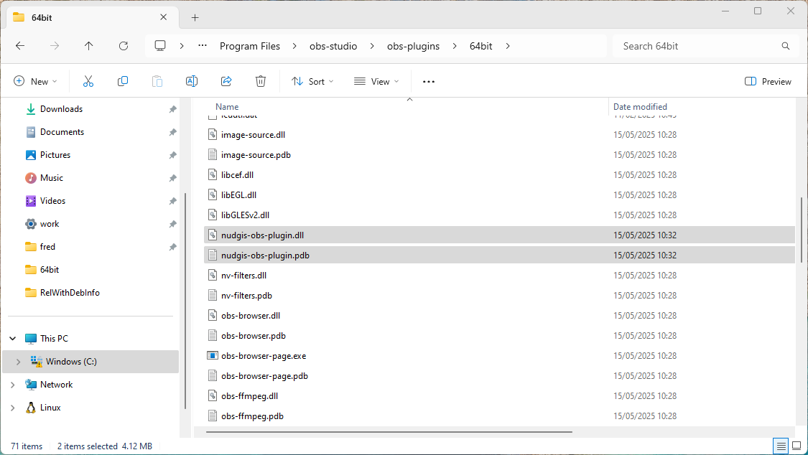

# Nudgis OBS Studio

## Description

The Nudgis OBS Studio plugin makes it easy to interface [Open Broadcaster Software](https://obsproject.com) with the [Nudgis platform from UbiCast](https://www.ubicast.eu).

The functionality of the plugin covers the following actions:
- performing live streams
- uploading recordings

The plugin is available for the following platforms:
- [Windows](#Windows) 10/11 64 bits
- [macOS](#macOS) (arm64 and x86)
- [Linux](#Linux):
  - [Ubuntu](#Ubuntu) >= 24.04 (Noble Numbat) with latest OBS Studio via the official [PPA](https://launchpad.net/~obsproject/+archive/ubuntu/obs-studio)
  - [Arch Linux](#Archlinux)
  - All distributions with the Flatpak installation [Flatpak Installation](#Flatpak))

See the release notes for the minimal version of each OS

## Usage

Check out [our tutorial](https://help.ubicast.tv/permalink/v1263f480e913w8vr71t/iframe/).

<a target="_blank" title="Nudgis OBS Plugin Tutorial" href="https://help.ubicast.tv/permalink/v1263f480e913w8vr71t/iframe/"></a>

## Installation

OS-specific packages are available in the [releases github page](https://github.com/UbiCastTeam/nudgis-obs-plugin/releases). 

An [AUR package](https://aur.archlinux.org/packages/nudgis-obs-plugin) is available for Arch Linux.

### Windows

We follow the OBS plugin template installing advice that favor zip archive for
portable installs and to mitigates code signing warnings or false positive anti
virus.

The Windows is distributed as `nudgis-obs-plugin-1.0.0-windows-x64.zip` zip file
which have the following tree one extracted:

```
└── nudgis-obs-plugin
    ├── bin
    │   └── 64bit
    │       ├── nudgis-obs-plugin.dll
    │       └── nudgis-obs-plugin.pdb
    └── data
        └── locale
            ├── en-US.ini
            └── fr-FR.ini
```

For the install you will have to manually copy files in the OBS installation
folder (this will also work if you have a portable OBS version installed):

1. plugin binaries:

Copy the `nudgis-obs-plugin.dll` and `nudgis-obs-plugin.pdb` into you OBS
`obs-studio\bin\64bits` folder (`C:\windows\Program Files\obs-studio\bin\64bits` for
regular installation)



2. data files:

Data files shall be copied into
`obs-studio\data\obs-plugins\nudgis-obs-plugin\locale`, and prior to copy the
file you have to create the `obs-studio\data\obs-plugins\nudgis-obs-plugin`
folder, then you can copy the `en-US.ini` and `fr-FR.ini` file into it.


### macOS

Download the universal .pkg package from the [releases github page](https://github.com/UbiCastTeam/nudgis-obs-plugin/releases).

The universal package can be installed on both x86 and arm64 machines.

After download follow these steps:

* open the Download folder, then `right click` on the file and choose `Open`


* As the plugin is not signed you will have to confirm that you want to open it by clicking `Open`


* Click `Continue` on the installer until the `Installation Type` step, at this step you *must* click `Change Install Location` and then choose `Install for me only`


* If everything went well you will see this


> :warning:  Depending on the level of security you may also have to allow the installation of apps downloaded for elsewhere than App store, this can be done by opening the `System Preferences` and tick the `App Store and identified developers` box in `Security and Privacy` tab:


(you will also have to explicitly allow the app in this window)

### Linux

#### Ubuntu 

For Ubuntu we only support OBS studio from the official OBS PPA as
described on the [OBS website](https://obsproject.com/download#linux)

Before installing OBS you have to check that the major version (i.e. `31` for
obs-studio 31.0.0) match with the `nudgis-obs-plugin` available in the
[releases github page](https://github.com/UbiCastTeam/nudgis-obs-plugin/releases)

See the [PPA page](https://launchpad.net/~obsproject/+archive/ubuntu/obs-studio/+packages)
to check the version.

If you have a match then you can install OBS:

```
sudo apt install software-properties-common
sudo add-apt-repository ppa:obsproject/obs-studio
sudo apt update
sudo apt install obs-studio
```

Then install the plugin:

```
sudo apt install ./nudgis-obs-plugin-1.0.0-linux-x86_64.deb
```

######  Flatpak

Flatpak offer an isolated, distribution agnostic way to install and use OBS studio.

To install the latest flatpak OBS version use:

```
flatpak install com.obsproject.Studio
```

You can now install `nudgis-obs-plugin`

1. Download [nudgis-obs-plugin.flatpak](flatpak/release/nudgis-obs-plugin.flatpak)

2. Instal it with

```
flatpak install nudgis-obs-plugin_VERSION.flatpak
```
	
#### Archlinux

Nudgis OBS plugin is available from AUR https://aur.archlinux.org/packages/nudgis-obs-plugin, use you preferred AUR packet manager to install it, for instance with `yay`:

```
yay -S nudgis-obs-plugin
```

## Uninstallation

### Windows

As you have manually copied the file you can delete them to remove the plugin.


### macOS

To remove this plugin open the terminal and type:

```
rm -rf "$HOME/Library/Application Support/obs-studio/plugins/nudgis-obs-plugin.plugin/"
pkgutil --volume ~ --forget eu.ubicast.nudgis-obs-plugin
```

### Ubuntu

```
sudo apt remove nudgis-obs-plugin
```

## Development

### CI artifacts description

Deployment binaries are generated by the github/actions (Artifacts) CI, and are accessible from the [Actions section of the project repository](https://github.com/UbiCastTeam/nudgis-obs-plugin/actions).  

The file name of an Artifacts respects the following format:

\<name_of_plugin>-\<version_of_plugin>-\<platform>\

For example
<pre>
 nudgis-obs-plugin-1.0.0-linux-x86_64.deb
</pre>

Below is the listing of Artifact names, containing the deployment binaries for each platform for version 1.0.0 of the Nudgis OBS Studio plugin compiled for OBS >= 28:

| Platform | Artifact Name                                        | Note                                                                                                                              |
| -------- | ---------------------------------------------------- | --------------------------------------------------------------------------------------------------------------------------------- |
| Linux    | nudgis-obs-plugin-1.0.0-linux-x86_64-linux-gnu.deb   | Debian .deb package, may be used for other Linux platforms[1]                                                                     |
| MacOS    | nudgis-obs-plugin-1.0.0-macos-universal.pkg          | Universal MacOS package (intel x86 and ARM based)                                                                                 |
| Windows  | nudgis-obs-plugin-1.0.0-windows-x64.zip              | Windows 64 bits portable archive                                                                                                  |

### Build of the flatpak package

A new build have to be done each time the OBS API breaks, when this happens
(major version change) you have to re generate the package, thanks to this
[](flatpak/Makefile).

### Setting up the development environment on Ubuntu 20.04

#### OBS compilation and installation in debug mode

> :information_source: update the version to the current plugin and OBS version

Activation of deb-src repositories in /etc/apt/sources.list
<pre>
sudo perl -pi -0e 's/^(deb .*\n)# (deb-src)/$1$2/gm' /etc/apt/sources.list
sudo apt update
</pre>

Fetching sources, config
<pre>
sudo apt build-dep obs-studio
sudo apt install git wget libwayland-dev libxkbcommon-dev libxcb-composite0-dev libpci-dev qtbase5-private-dev
git clone https://github.com/obsproject/obs-studio.git
cd obs-studio
git checkout 27.2.4 -b 27.2.4
git submodule init
git submodule update
export CI_LINUX_CEF_VERSION=$(cat .github/workflows/main.yml | sed -En "s/[ ]+LINUX_CEF_BUILD_VERSION: '([0-9]+)'/\1/p")
wget https://cdn-fastly.obsproject.com/downloads/cef_binary_${CI_LINUX_CEF_VERSION}_linux64.tar.bz2
tar -xvaf cef_binary_${CI_LINUX_CEF_VERSION}_linux64.tar.bz2
cmake -B build . -DCMAKE_BUILD_TYPE=Debug -DENABLE_PIPEWIRE=FALSE -DCEF_ROOT_DIR=${PWD}/cef_binary_${CI_LINUX_CEF_VERSION}_linux64 -DCMAKE_CXX_FLAGS_DEBUG='-O0 -g3' -DCMAKE_C_FLAGS_DEBUG='-O0 -g3'
</pre>

Compiling and Installing
<pre>
cmake --build build
sudo cmake --install build
sudo ldconfig
</pre>

#### nudgis-obs-plugin compilation and installation in debug mode

<pre>
git clone git@github.com:UbiCastTeam/nudgis-obs-plugin.git
cd nudgis-obs-plugin
cmake -B build . -DCMAKE_BUILD_TYPE=Debug -DCMAKE_CXX_FLAGS_DEBUG='-O0 -g3' -DCMAKE_C_FLAGS_DEBUG='-O0 -g3'
cmake --build build
sudo cmake --install build
</pre>

#### Starting a GDB debug session

Installing gdb
<pre>
sudo apt install gdb
</pre>

Starting a debug session - with a breakpoint on the plugin initialization function
<pre>
gdb -ex 'set breakpoint pending on' -ex 'b src/nudgis-plugin.cpp:obs_module_load' -ex r obs
</pre>

Launching a debug session
<pre>
gdb obs
</pre>
