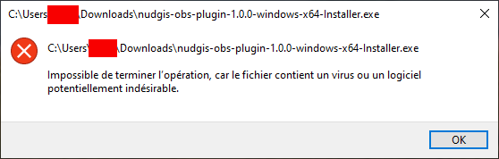
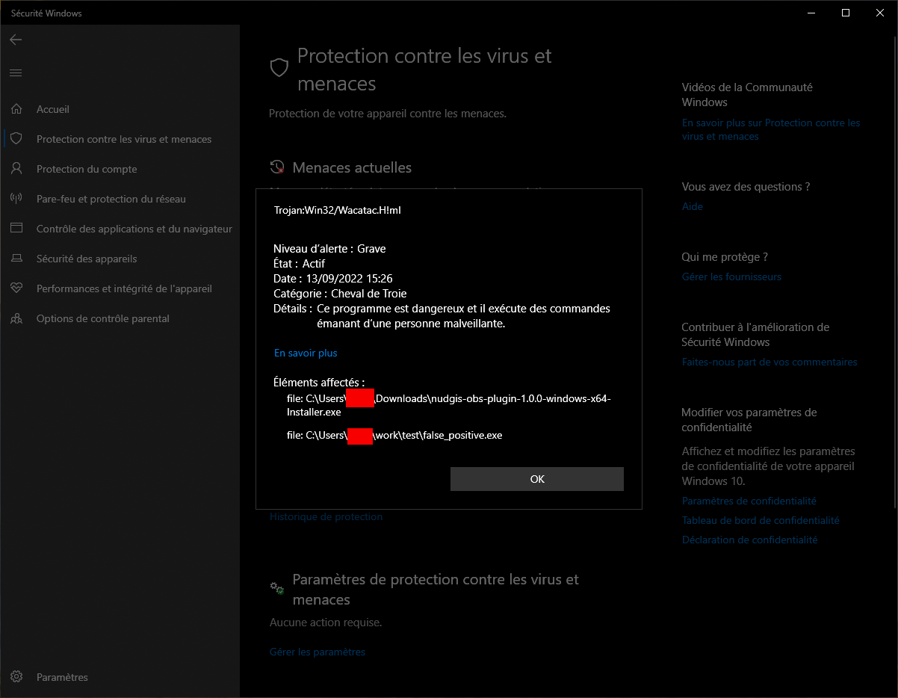
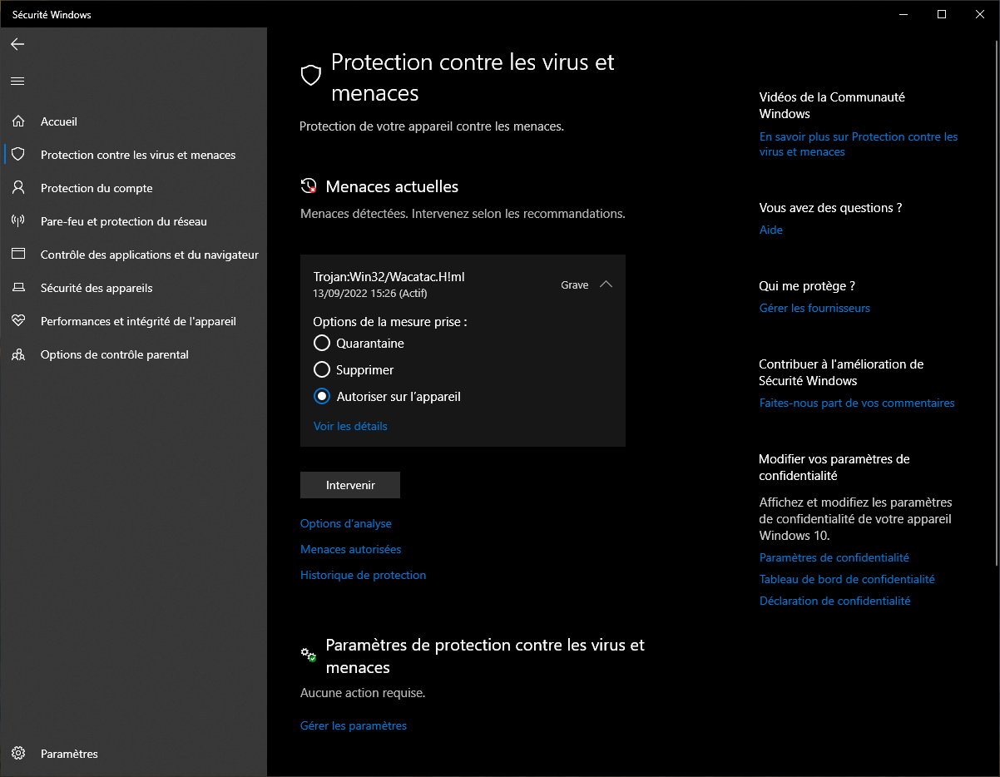

# Windows Microsoft Defender bypass

In case the plugin is detected as a malware, follow this instruction to bypass
Microsoft Defender:

First check that this is indeed a false positive by uploader the file on on online virus analyzer (like https://www.virustotal.com or https://metadefender.opswat.com/), when you are confident that it is indeed a false positive you will have to tell Miscrosoft Defender to allow the execution of this file to avoid the following alert:

To allow the execution, open the Microsoft Defender settings tab (type `defender` in the windows search bar) then look for the thread corresponding to the installer and double-check by clicking `details`

Then go back and finally tick the `Allow on device` box:

You can then follow the regular installation procedure
